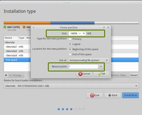
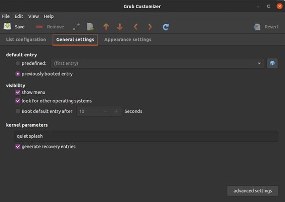

# Computerized_Alcoholism
Robot throws ping pong ball into cup

nice, yes?

# Installation guide
Backup your files, I resign all responsibility if you mess up anything in your files by following this.
Also, never ever use the restart or hibernate functions on your PC after dualbooting - Always shut it down fully.
## Ubuntu Dual Booting
### Disable BitLocker Drive Encryption
First, disable your disc encryption if it is active - As that will block you from resizing the Windows partition

Click Start, click Control Panel, click System and Security, and then click BitLocker Drive Encryption.

Look for the drive on which you want BitLocker Drive Encryption turned off, and click Turn Off BitLocker.

A message will be displayed, stating that the drive will be decrypted and that decryption may take some time.

Once ready, Click Turn off Bitlocker / Decrypt the drive to continue and turn off BitLocker on the drive.

### Disable fast boot to avoid driver problems

Press the Windows key on your keyboard, and type in Command Prompt.

Without pressing Enter, right-click the cmd icon that appears, then select Run as administrator.

Type in `powercfg -h off` and press Enter.

### Ubuntu Installation
Download [Rufus](https://github.com/pbatard/rufus/releases/download/v3.15/rufus-3.15.exe) &amp; [the Ubuntu .iso file](https://ubuntu.com/download/desktop/thank-you?version=20.04.3&amp;architecture=amd64)

Use Rufus to create a boot file on your flash drive

Boot from the flash drive (Do an advanced start and boot from the flash drive)

First, you reduce the Windows partition by the amount of space you want your Ubuntu partition to have available. (Be careful when you mess around with your partitions, as you can seriously mess up your files.)

Then you create a new partition from the newly aquired free space, with the Ext4 format, which mounts on **/**

And you will need a BIOS partition with the size of 1 MB.



Then you just click Install Now and follow through the installer.

You may have some problems booting into Ubuntu after installation, then you just load the boot menu on start (F2 or F10 by default on most laptops, but use google to find yours)

### Select OS every time you boot
Hvis du vil kunne vælge hvilken OS du booter fra når du starter op, skal du bruge grub-customizer

Run the following commands

`sudo apt install grub-customizer`

`grub-customizer`

Then you remove the tick from &quot;Boot default entry after x Seconds&quot;, under &quot;General settings&quot;.



Remember to hit save, before you quit.

## Install Google Chrome
Run the following commands to install Google Chrome

`wget https://dl.google.com/linux/direct/google-chrome-stable_current_amd64.deb`

`sudo dpkg -i google-chrome-stable_current_amd64.deb`

## Customize the dock
Run the following commands to install dconf-editor in which you can customize the dock

`git clone https://gitlab.gnome.org/GNOME/dconf-editor.git`

`sudo apt install dconf-editor`

`dconf-editor`

Go to `/org/gnome/shell/extensions/dash-to-dock/` and change what you want to change

## Install QT Creator
Run the following commands to install QT Creator and its dependencies

`sudo apt install qtcreator build-essential qt5-default qt5-doc qt5-doc-html qtbase5-doc-html qtbase5-examples`

## Install RTDE
Run the following commands to install RTDE

`sudo add-apt-repository ppa:sdurobotics/ur-rtde`

`sudo apt update`

`sudo apt install librtde librtde-dev`

`sudo apt install libboost-all-dev`

`git clone https://gitlab.com/sdurobotics/ur_rtde.git`

`cd ur_rtde`

`git submodule update --init --recursive`

`mkdir build && cd build`

`cmake ..`

`make`

`sudo make install`

Then you can link RTDE with Cmake

```cmake
cmake_minimum_required(VERSION 3.5)

project(ur_rtde_cmake_example)

find_package(ur_rtde REQUIRED)

add_executable(ur_rtde_cmake_example main.cpp)

target_link_libraries(ur_rtde_cmake_example PRIVATE ur_rtde::rtde)
```

## Installer OpenCV
Run the following commands to install OpenCV

`sudo apt install build-essential cmake git libgtk2.0-dev pkg-config libavcodec-dev libavformat-dev libswscale-dev python-dev python-numpy libtbb2 libtbb-dev libjpeg-dev libpng-dev libtiff-dev libdc1394-22-dev libcanberra-gtk-module`

`git clone https://github.com/opencv/opencv.git && git clone https://github.com/opencv/opencv_contrib.git && cd ./opencv && mkdir build && cd ./build`

`cmake -DCMAKE_BUILD_TYPE=Release -DCMAKE_INSTALL_PREFIX=/usr/local -DBUILD_DOCS=ON -DBUILD_EXAMPLES=ON -DOPENCV_EXTRA_MODULES_PATH=&quot;~/opencv_contrib/modules&quot; -DPYTHON3_EXECUTABLE=/usr/bin/python3.8 -DPYTHON_INCLUDE_DIR=/usr/include/python3.8 -DPYTHON_INCLUDE_DIR2=/usr/include/x86_64-linux-gnu/python3.8 -DPYTHON_LIBRARY=/usr/lib/x86_64-linux-gnu/libpython3.8.so -DPYTHON3_NUMPY_INCLUDE_DIRS=/usr/lib/python3.8/dist-packages/numpy/core/include/ -DOPENCV_GENERATE_PKGCONFIG=ON -DBUILD_opencv_apps=ON ..`

`make -j$((`nproc`-1))`

`sudo make install`

Then you can link it with Cmake

```cmake
cmake_minimum_required(VERSION 2.8)

project( main )

find_package( OpenCV REQUIRED )

include_directories( ${OpenCV_INCLUDE_DIRS} )

add_executable( main main.cpp )

target_link_libraries( main ${OpenCV_LIBS} )
```

## Install URSim
Install Java 8

Run the following command

`sudo apt install openjdk-8-jdk`

Confirm that you are using the right version of Java

`java -version`

You should get an output similar to this
```
openjdk version "1.8.0_292"

OpenJDK Runtime Environment (build 1.8.0_292-8u292-b10-0ubuntu1~20.04-b10)

OpenJDK 64-Bit Server VM (build 25.292-b10, mixed mode)
```

If there are multiple versions of Java, you must choose 8 (1.8)

`sudo update-alternatives --config java`

### Installer libcurl4

Kør følgende commands

`sudo apt install libcurl4`

`sudo ln -s /usr/lib/x86_64-linux-gnu/libcurl.so.4.5.0 /usr/lib/x86_64-linux-gnu/libcurl.so.4.7.0`

`sudo add-apt-repository ppa:ondrej/php`

`sudo apt update`

`sudo apt install php7.2-fpm php7.2-gd php7.2-curl php7.2-mysql php7.2-dev php7.2-cli php7.2-common php7.2-mbstring php7.2-intl php7.2-zip php7.2-bcmath`

### Download & Install URSim
Download the newest URSim from [URs webpage](https://www.universal-robots.com/download/?query=ursim)

(Choose the filters **Robot arm size: UR5** and **Software: Linux Offline simulator** )

I downloaded [CB-SERIES - LINUX - URSIM-3.15.4](https://www.universal-robots.com/download/software-cb-series/simulator-linux/offline-simulator-cb3-linux-ursim-3154/)

**Unzip the file**

Run the following commands

`cd /home/(brugernavn)/`

`tar xvzf URSim_Linux-X.XX.X.XXXXXX.tar.gz` (Where X.XX.X.XXXXXX is your version)

`sudo mv /Downloads/ursim-X.XX.X.XXXXXX/ ~/`

You will now have a file called **ursim-X.XX.X.XXXXXX** in **/home/(brugernavn)/**

In the file **install.sh** in the folder **ursim-X.XX.X.XXXXXX**, replace the following line

`commonDependencies='libcurl3 libjava3d-* ttf-dejavu* fonts-ipafont fonts-baekmuk fonts-nanum fonts-arphic-uming fonts-arphic-ukai'`

with

`commonDependencies='libcurl4 openjdk-8-jre libjava3d-* ttf-dejavu* fonts-ipafont fonts-baekmuk fonts-nanum fonts-arphic-uming fonts-arphic-ukai'`

Remember saving the file before exiting

**Make the necessary files executable**

Cd into the ursim folder

`cd /home/(brugernavn)/ursim-X.XX.X.XXXXXX`

Run the following commands

`sudo chmod +x start-ursim.sh`

`sudo chmod +x starturcontrol.sh`

`sudo chmod +x stopurcontrol.sh`

`sudo chmod +x URControl`

Run the installer

`./install.sh`

Now you can run the simulator, I recommend running it as sudo first, then normally - That way you force the controller to start first.

`sudo ./start-ursim.sh`

`./start-ursim.sh`
